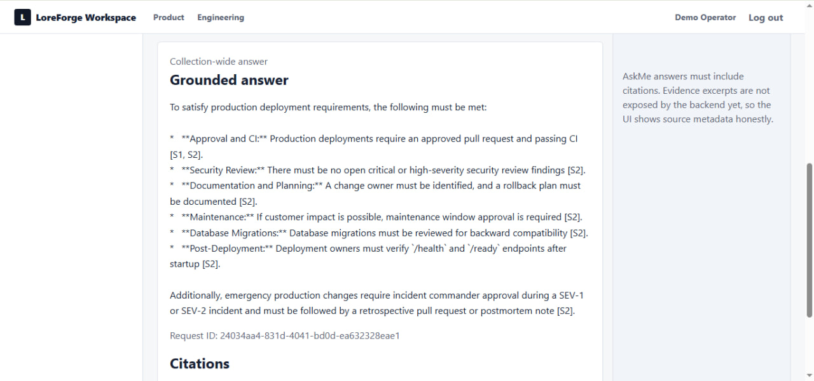
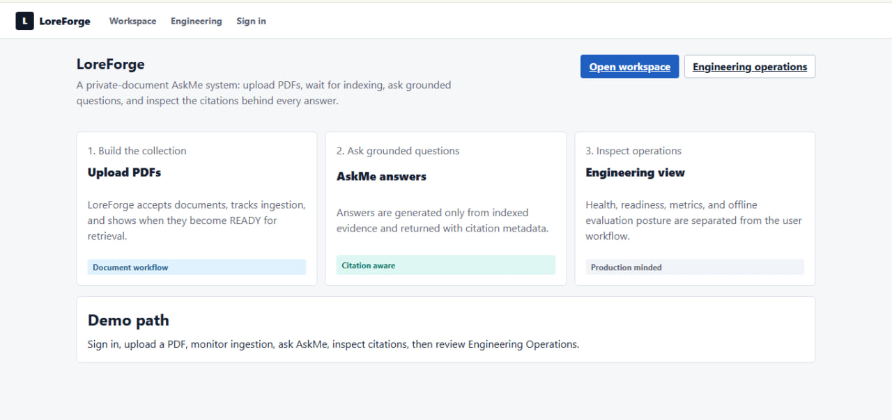
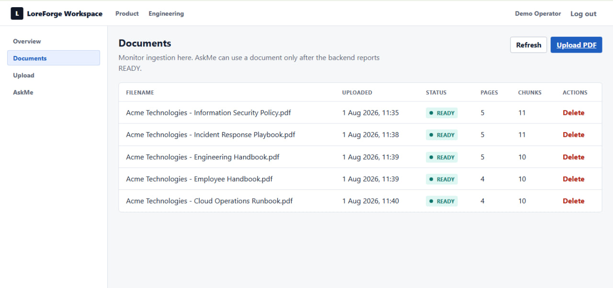
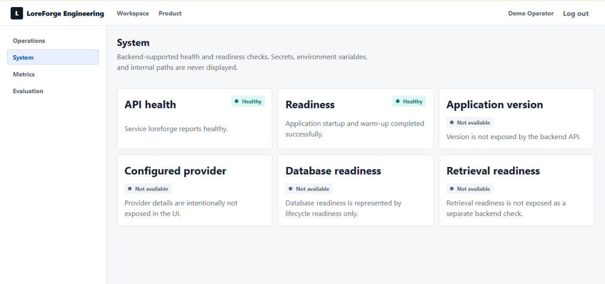

# LoreForge

Production-minded enterprise RAG system with hybrid retrieval, document ownership controls, and citation enforcement.

LoreForge is a portfolio-grade backend and frontend project for a grounded question-answering assistant named AskMe. It demonstrates how an enterprise RAG workflow can be made inspectable: documents are parsed and chunked deterministically, retrieval combines semantic and lexical signals, answers are generated through provider abstractions, and citations are validated before a response is returned.

The project is local-first and deterministic by default. Providers, authentication, and PostgreSQL are configurable, but disabled unless explicitly enabled.

## Demo

**Video demo:** [Watch the LoreForge demo](https://youtu.be/3K6DPf49Cp4)

Raw URL:
https://youtu.be/3K6DPf49Cp4

## Key Capabilities

| Area | Implemented |
| --- | --- |
| Ingestion | PDF validation, page-aware parsing, text normalization, citation-aware chunking, indexing orchestration |
| Retrieval | Semantic vector search, BM25 lexical search, Reciprocal Rank Fusion, metadata filtering, duplicate elimination |
| Reranking | Local CrossEncoder reranker with startup warm-up support |
| Generation | Provider-independent generation with Gemini and OpenRouter adapters |
| Grounding | Evidence context construction, grounded prompts, citation extraction, citation enforcement, validated answers |
| Persistence | PostgreSQL-backed metadata, users, ownership, indexing state, chunks, embeddings, and retrieval records |
| Security | API-key bearer authentication and owner-scoped document/catalog operations |
| Runtime | Dependency injection, lifecycle readiness, structured logging, metrics, Gemini retry handling, graceful shutdown |
| Quality | Offline deterministic tests, Ruff, mypy, GitHub Actions CI, Docker packaging |
| Frontend | React/Vite workspace for authentication, documents, AskMe, citations, and engineering operations |

## Architecture Overview

LoreForge follows a Clean Architecture shape:

```text
FastAPI routes / React UI
  -> application services and container
  -> domain models, protocols, and workflows
  -> infrastructure adapters for databases and providers
```

The composition root wires concrete providers and repositories into framework-independent services. The core query engine does not know about FastAPI, environment variables, SQLAlchemy sessions, Gemini clients, or frontend transport models.



Additional architecture assets:

- [Document ingestion and indexing flow](docs/architecture/images/document-ingestion-and-indexing-flow.svg) ([source](docs/architecture/diagrams/document-ingestion-and-indexing-flow.mmd))
- [Clean architecture dependency direction](docs/architecture/images/clean-architecture-dependency-direction.svg) ([source](docs/architecture/diagrams/clean-architecture-dependency-direction.mmd))
- [Runtime lifecycle and readiness](docs/architecture/images/runtime-lifecycle-and-readiness.svg) ([source](docs/architecture/diagrams/runtime-lifecycle-and-readiness.mmd))
- [Mermaid source for high-level system architecture](docs/architecture/diagrams/high-level-system-architecture.mmd)

## How The RAG Pipeline Works



[Mermaid source for the AskMe flow](docs/architecture/diagrams/askme-grounded-query-flow.mmd)

Important boundaries:

- `POST /documents/upload` validates and accepts a PDF, but does not durably store the PDF or index it.
- Actual indexing happens through the admin catalog/indexing workflow.
- Original PDF bytes are not durably stored.
- Retrieval can use persisted metadata, chunks, embeddings, and retrieval records, but a full production rebuild strategy still needs durable original-file storage or a formal rebuild worker/runbook.
- `/ready` reports only in-process lifecycle readiness. It performs no live database, Gemini, reranker, query-engine, or external dependency checks at request time.

## Screenshots



*Grounded multi-source answer*

| Product overview | Indexed document collection | Operations dashboard |
| --- | --- | --- |
|  |  |  |

## Technology Stack

| Layer | Tools |
| --- | --- |
| Backend | Python 3.13, FastAPI, Uvicorn, uv |
| Data | PostgreSQL, SQLAlchemy, Alembic, psycopg |
| Documents | pypdf |
| Retrieval | local vector index, BM25, Reciprocal Rank Fusion |
| Models/providers | Sentence Transformers, local CrossEncoder, Gemini via `google-genai`, OpenRouter adapter |
| Quality | pytest, Ruff, mypy |
| Runtime | Docker, Docker Compose, structured logging, in-process metrics |
| Frontend | React, TypeScript, Vite, React Router, TanStack Query, React Hook Form, Zod, Vitest, React Testing Library |
| CI | GitHub Actions in `.github/workflows/ci.yml` |

## Project Structure

```text
frontend/         React product workspace
src/loreforge/
  api/              FastAPI routes and transport models
  application/      application container and composition root
  askme/            AskMe application service
  auth/             user identity, principals, API-key authentication
  catalog/          document metadata and lifecycle catalog
  database/         SQLAlchemy models, repositories, database runtime
  documents/        upload validation, parsing, normalization, chunking, ingestion
  embeddings/       embedding models and provider adapters
  evaluation/       deterministic quality evaluation
  generation/       evidence, prompts, providers, citations, validation
  indexing/         ingestion-to-index orchestration
  observability/    request IDs, traces, metrics, runtime observations
  query/            production grounded-query engine
  reranking/        reranker contracts and local CrossEncoder adapter
  retrieval/        BM25, hybrid retrieval, durable retrieval contracts
  vector_index/     in-memory vector index primitives
migrations/       Alembic migrations
tests/            deterministic backend test suite
docs/             public engineering documentation
```

## Quick Start

Install backend dependencies:

```powershell
uv sync --all-groups
```

Run the backend natively:

```powershell
uv run --locked uvicorn loreforge.main:app --app-dir src
```

Useful backend endpoints:

- `GET /health`
- `GET /ready`
- `GET /metrics`
- `GET /docs`

Run the frontend separately:

```powershell
cd frontend
npm install
npm run dev
```

Docker prerequisite: Docker Desktop or another Docker daemon must be running.

Development Compose startup uses `docker-compose.override.yml`, mounts `./src`, enables Uvicorn reload, and uses a Hugging Face cache volume when local model providers are configured:

```powershell
docker compose up --build
```

Stop development Compose:

```powershell
docker compose down
```

Production-style local backend startup excludes the development override and uses only the base Compose file:

```powershell
docker compose -f docker-compose.yml up --build
```

Stop production-style local Compose:

```powershell
docker compose -f docker-compose.yml down
```

Compose loads optional `.env.docker` values when the file exists. Keep provider keys, database URLs, and API keys in environment variables or local env files that are never committed. The Docker image currently packages the backend only; run the Vite frontend separately.

## Configuration Overview

Configuration lives in `src/loreforge/settings.py` and is documented in `.env.example` and [docs/configuration.md](docs/configuration.md).

Default local posture:

- providers are `disabled`
- auth is `disabled`
- PostgreSQL is disabled when `LOREFORGE_DATABASE_URL` is empty
- live Gemini and database smoke tests are skipped
- `/ask` returns `503` until providers, retrieval data, and runtime dependencies are configured

Common production-facing settings include:

- `LOREFORGE_ENVIRONMENT=production`
- `LOREFORGE_PUBLIC_BASE_URL=...`
- `LOREFORGE_DATABASE_URL=...`
- `LOREFORGE_AUTH_PROVIDER=api_key`
- `LOREFORGE_AUTH_API_KEYS=...`
- `LOREFORGE_AUTH_DEMO_USER_IDS=...` for read-only demo users
- `LOREFORGE_DOCUMENT_EMBEDDINGS_PROVIDER=local|gemini`
- `LOREFORGE_QUERY_EMBEDDINGS_PROVIDER=local|gemini`
- `LOREFORGE_RERANKER_PROVIDER=local`
- `LOREFORGE_LLM_PROVIDER=gemini|openrouter`

Secrets are supplied through environment variables and are not required for the default offline test path.

## Testing And Quality Gates

Current verified backend result:

```text
1407 passed, 2 skipped
```

Backend checks:

```powershell
uv run --locked pytest
uv run --locked ruff format --check .
uv run --locked ruff check .
uv run --locked mypy src
git diff --check
```

Frontend checks:

```powershell
cd frontend
npm run typecheck
npm test
npm run lint
npm run build
```

CI exists at `.github/workflows/ci.yml` and runs deterministic backend and frontend checks without live provider calls.

## Docker Status

Docker support is implemented with `Dockerfile`, `.dockerignore`, `docker-compose.yml`, and `docker-compose.override.yml`.

Current Docker architecture:

- The Dockerfile builds a backend-only Python image with locked production dependencies from `uv.lock`.
- The runtime image copies `src/`, `alembic.ini`, and `migrations/`; `frontend/`, `docs/`, and tests are excluded from the image context by `.dockerignore`.
- The container runs as the non-root `loreforge` user and exposes port `8000`.
- The Dockerfile healthcheck calls `/health`.
- Compose publishes `${LOREFORGE_API_PORT:-8000}:8000`, uses the `loreforge` bridge network, and checks `/ready`.
- Base Compose optionally loads `.env.docker`.
- The development override mounts source code, enables reload, and adds a Hugging Face cache volume.

Verification status:

- `docker compose -f docker-compose.yml config` succeeded.
- `docker compose config` succeeded and confirmed the development override behavior.
- A fresh production image build and container smoke test could not be rerun because Docker Desktop's Linux engine was unavailable on this host during the audit.
- Earlier hardening verified a production image build, non-root runtime, `/health`, `/ready`, and a basic smoke request. Re-run those checks on a healthy Docker daemon before deployment approval.

## Known Limitations

- `POST /documents/upload` validates and accepts a PDF, but does not persist original PDF bytes or index documents.
- Actual indexing happens through the admin catalog/indexing workflow.
- Original PDF bytes are not durably stored anywhere yet.
- Runtime vector/BM25 structures still need an explicit rebuild strategy after restart or redeploy.
- Authenticated `/ask` requests are scoped to the requesting owner; demo identities can be configured as read/query-only with an in-process `/ask` rate limit.
- `/ready` is lifecycle-state only; it does not prove PostgreSQL, Gemini, OpenRouter, or model-cache reachability.
- Metrics are in-process and reset on restart.
- Evaluation is deterministic fixture mode, not live production quality evaluation.
- OAuth/OIDC, roles, RBAC, rate limiting, object storage, Kubernetes, horizontal scaling, and distributed tracing are not implemented.
- Live provider behavior depends on configured API keys, provider availability, model limits, and local model cache state.

## Roadmap

Near term:

- Add durable original-file storage or an explicit retrieval rebuild worker/runbook.
- Re-run Docker image build and container smoke verification on a stable Docker Desktop/daemon.

Mid term:

- Background indexing workers with retry and idempotency controls.
- External metrics export, dashboards, and alerts.
- Larger human-reviewed golden evaluation set.

Long term:

- OIDC/JWT enterprise identity integration.
- Durable vector/BM25 backend or fully rebuildable retrieval service.
- Backup/restore and disaster-recovery procedures.
- Optional model-assisted evaluation alongside deterministic gates.

## Engineering Highlights

- Demonstrates end-to-end enterprise RAG architecture rather than a single prompt demo.
- Uses hybrid retrieval: semantic search plus BM25, fused with Reciprocal Rank Fusion.
- Adds CrossEncoder reranking before evidence is sent to generation.
- Enforces citations before returning answers to users.
- Preserves Clean Architecture with provider and repository abstractions.
- Includes API-key authentication, owner-scoped document operations, PostgreSQL persistence, readiness, retries, metrics, CI, and Docker packaging.
- Keeps default development deterministic, offline, and zero-cost.

For deeper context, see [docs/demo-guide.md](docs/demo-guide.md) and [docs/final-engineering-audit.md](docs/final-engineering-audit.md).
