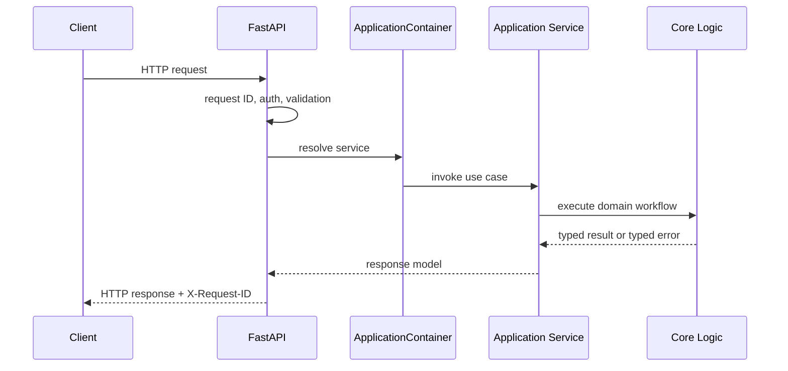
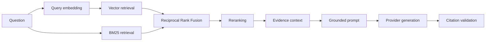
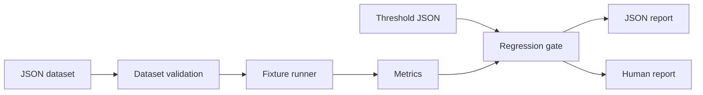

# Architecture Guide

LoreForge is organized around Clean Architecture: framework-specific code is kept
at the edges, while document processing, retrieval, generation, evaluation, and
observability logic stay framework-independent where practical.

## Request Lifecycle



Transport concerns such as request parsing, response codes, and auth headers live
under `src/loreforge/api`. Core services receive typed inputs and do not depend
on FastAPI request objects.

## Ingestion Lifecycle


Failures after indexing begins attempt rollback for semantic, lexical, chunk, and
embedding writes, then mark the document failed. Ownership is enforced before
document metadata, indexing, and retrieval operations.

## Retrieval Lifecycle



The production query engine composes existing retrieval, reranking, evidence,
prompt, generation, and citation components. It does not instantiate providers or
read configuration. Concrete dependencies are supplied by the application
composition root.

## Evaluation Lifecycle



The current evaluator is deterministic fixture mode. It is suitable for CI and
portfolio review because it avoids live providers, live databases, network
access, and nondeterministic model judging.

## Observability Flow

```mermaid
flowchart LR
  H[HTTP middleware] --> C[Request-local context]
  H --> L[Structured request log]
  H --> M[HTTP metrics]
  R[Readiness] --> M
  Q[Query engine] --> T[Query trace]
  Q --> M
  I[Indexing service] --> M
  P[Provider adapters] --> M
  M --> E[/metrics snapshot]
```

Metrics use bounded labels and avoid request IDs, user IDs, document IDs,
filenames, prompts, full questions, answers, raw document text, vectors, secrets,
and provider payloads.

## Dependency Direction

```text
API adapters
  -> application composition/services
  -> LoreForge-owned protocols and core workflows
  -> infrastructure adapters
  -> external libraries/providers
```

Provider-specific clients belong at infrastructure boundaries. Business logic
should depend on LoreForge contracts or narrow callables, not hosted vendor SDKs.
